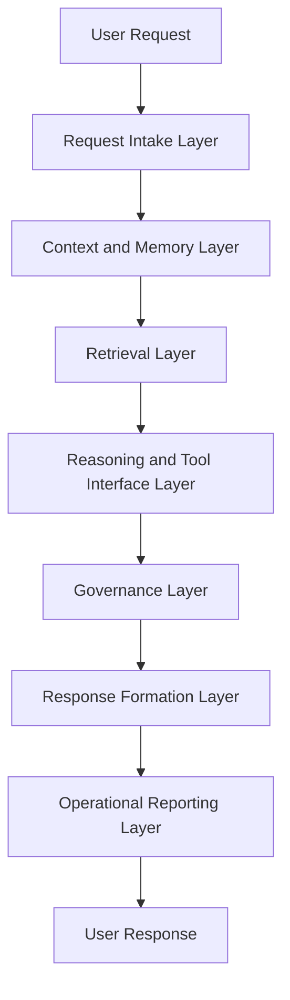
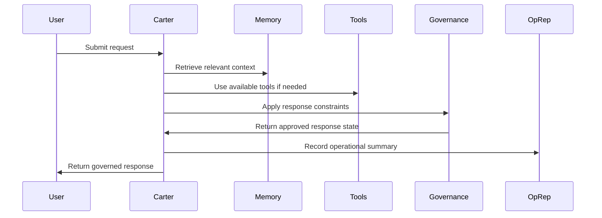

# Synthetic OS

**Synthetic OS** is an experimental AI systems architecture for building governed, memory-enabled, tool-aware AI agents.

This repository provides a public architecture overview of Synthetic OS and **Carter**, its flagship implementation developed by **Synthetic OS Labs**. It is intended for technical review, portfolio evaluation, and high-level system understanding.

Production source code, private prompts, internal memory data, operational logs, credentials, deployment details, and proprietary orchestration logic are intentionally excluded.

---

## Repository Status

**Status:** Public architecture disclosure / portfolio repository
**Implementation:** Proprietary / private
**Flagship instance:** Carter
**Maintainer:** Synthetic OS Labs

This repository is not a full open-source release of Synthetic OS. It is a public-facing technical overview designed to communicate the architecture, design principles, and engineering direction of the system without disclosing proprietary implementation details.

---

## What Is Synthetic OS?

Synthetic OS is a governed AI runtime layer designed to support AI agents that require:

* Persistent memory
* Retrieval-augmented context
* Tool-aware reasoning
* Operational traceability
* Human-centered governance
* Local-first deployment options
* Structured interaction workflows

Rather than treating an AI assistant as a single prompt-response interface, Synthetic OS treats the assistant as a coordinated system of memory, retrieval, governance, validation, and reporting layers.

At a high level, Synthetic OS is designed to help an AI agent remember, reason, act, and report in a controlled and auditable way.

---

## What Is Carter?

**Carter** is the flagship implementation of Synthetic OS.

Carter is a governed AI assistant designed around persistent memory, retrieval-augmented reasoning, operational reporting, and controlled interaction with specialized subsystems.

Carter serves as the primary working implementation of the Synthetic OS architecture and is used to explore how AI systems can be made more reliable, explainable, and useful through structured memory, governance, and validation layers.

Public documentation in this repository describes Carter at the architectural level only. The production Carter implementation remains private.

---

## High-Level Architecture



Synthetic OS separates raw model interaction from the broader system responsibilities needed for a more reliable AI runtime.

The system is organized around the idea that an AI assistant should not only generate responses, but also maintain context, respect governance constraints, track operational state, and support human review when appropriate.

---

## Core Concepts

### Memory-Enabled Operation

Synthetic OS supports the concept of layered memory. Carter uses memory to maintain conversational continuity, retrieve relevant prior context, and support long-running projects over time.

This repository discusses memory at the conceptual level only. It does not disclose database schemas, retrieval thresholds, memory records, vector store structures, or private user data.

### Governed Response Formation

Synthetic OS separates generation from governed response formation. Responses are shaped by safety boundaries, role constraints, operational context, and system-level decision rules.

The public repository describes this governance model at a high level. It does not disclose private governance prompts, complete directive sets, internal decision trees, or proprietary control logic.

### Operational Reporting

Carter uses operational reporting concepts to support traceability and debugging. These reports help summarize system activity, decision state, and execution flow.

Only sanitized examples are appropriate for this repository. Raw logs, private traces, backend paths, model routing details, and production reports are intentionally excluded.

### Tool-Aware AI Runtime

Synthetic OS is designed to support AI agents that can interact with tools, files, retrieval systems, validation systems, and specialized modules.

Tool interaction is presented here as a public architectural concept. Production tool wiring, credentials, API configuration, and internal orchestration details are not disclosed.

---

## Related Systems

Synthetic OS Labs has developed specialized systems that operate alongside or within the broader Synthetic OS architecture.

### SIS — Synthetic Ideation System

SIS is a governed invention and ideation workflow designed to support structured exploration of scientific, technical, and system-level concepts.

### EAS — Engineer Assistance System

EAS is a governed engineering advisory workflow designed to combine AI reasoning with structured validation, deterministic computation, and advisory reporting.

These systems are referenced only at a high level in this repository. Their proprietary workflows, prompts, validation logic, and implementation details are not included here.

---

## Public / Private Boundary

This repository intentionally includes:

* Public architecture summaries
* High-level system diagrams
* Conceptual module descriptions
* Sanitized examples
* Design principles
* Public-facing documentation
* Portfolio-oriented technical explanations

This repository intentionally excludes:

* Production source code
* Private prompts
* Internal memory databases
* Vector stores
* API keys
* Credentials
* `.env` files
* Backend logs
* Raw operational reports
* User conversation data
* Private governance logic
* Model routing logic
* Deployment configuration
* Proprietary orchestration code

The goal is to provide meaningful technical visibility while protecting the intellectual property and operational security of Synthetic OS Labs.

---

## Repository Structure

```text
synthetic-operating-system/
│
├── README.md
├── LICENSE
├── SECURITY.md
├── CONTRIBUTING.md
├── NOTICE.md
│
├── docs/
│   ├── architecture_overview.md
│   ├── carter_implementation_overview.md
│   ├── design_principles.md
│   ├── memory_model_public.md
│   ├── governance_model_public.md
│   ├── request_lifecycle.md
│   ├── validation_and_observability.md
│   ├── security_and_privacy_boundary.md
│   ├── glossary.md
│   └── roadmap.md
│
├── diagrams/
│   ├── sos_high_level_architecture.md
│   ├── carter_request_lifecycle.md
│   └── memory_governance_flow.md
│
├── examples/
│   ├── sanitized_interaction_example.md
│   ├── sanitized_oprep_example.md
│   ├── sanitized_memory_lifecycle.md
│   └── sanitized_governance_trace.md
│
└── public_specs/
    ├── module_index_public.md
    ├── interface_contracts_public.md
    └── non_goals.md
```

---

## Design Principles

Synthetic OS is guided by several core design principles:

1. **Governance before autonomy**
   AI systems should operate within explicit boundaries, especially when handling sensitive, technical, or high-impact tasks.

2. **Memory with user control**
   Long-running AI systems need memory, but memory should be inspectable, bounded, and governed.

3. **Traceability matters**
   AI systems should support operational reporting so behavior can be reviewed, debugged, and improved.

4. **Local-first where possible**
   Synthetic OS emphasizes local-first and privacy-conscious design where feasible.

5. **Human review remains essential**
   The system is designed to assist human decision-making, not replace human responsibility.

6. **Specialized systems should be modular**
   Carter, SIS, EAS, and related systems are treated as specialized implementations or workflows within the broader Synthetic OS architecture.

---

## Example Request Lifecycle

A typical Carter interaction can be understood as a structured flow:



This lifecycle is simplified for public documentation. The actual production implementation contains additional private logic and safeguards.

---

## Intended Audience

This repository is intended for:

* Technical recruiters
* Engineering managers
* AI researchers
* Software engineers
* Prospective collaborators
* Portfolio reviewers
* Organizations evaluating Synthetic OS Labs

The repository is designed to show the architecture and engineering direction behind Synthetic OS without exposing sensitive implementation details.

---

## Non-Goals

This repository is not intended to be:

* A full source-code release
* A deployable AI assistant
* A complete reproduction of Carter
* A prompt library
* A memory database dump
* A production configuration guide
* A public release of proprietary governance logic

---

## Current Development Focus

Synthetic OS Labs is currently focused on:

* Improving governed AI runtime architecture
* Expanding Carter’s reliability and memory behavior
* Developing structured AI workflows through SIS and EAS
* Improving operational reporting and validation
* Building safer human-AI collaboration patterns
* Preparing public documentation suitable for technical and professional review

---

## About Synthetic OS Labs

Synthetic OS Labs is an independent AI research and development effort focused on governed AI systems, memory-enabled assistants, and structured AI workflows.

The work centers on building practical AI systems that combine language models with memory, retrieval, validation, governance, and operational traceability.

---

## Contact

For professional inquiries, collaboration discussions, or technical review, contact Synthetic OS Labs through the maintainer’s public GitHub or professional profile.

---

## License and Disclosure Notice

This repository is provided for public documentation and portfolio review.

Unless otherwise stated, the documentation in this repository may be shared for review and discussion. The underlying implementation of Synthetic OS, Carter, SIS, EAS, and related systems remains proprietary to Synthetic OS Labs.

See `LICENSE.md` and `NOTICE.md` for additional terms.
