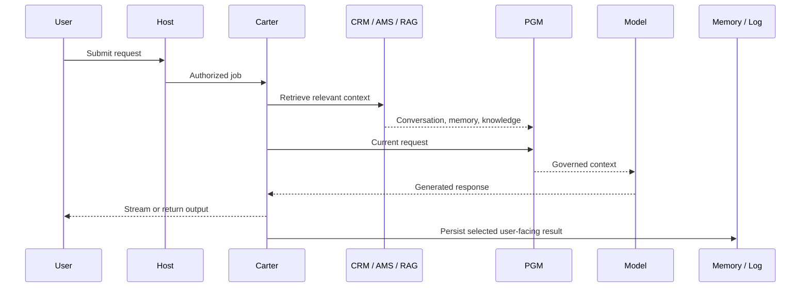

# Carter Request Lifecycle

```mermaid
sequenceDiagram
    participant User
    participant Host
    participant Carter
    participant Context as CRM / AMS / RAG
    participant PGM
    participant Model
    participant Store as Memory / Log

    User->>Host: Submit request
    Host->>Carter: Authorized job
    Carter->>Context: Retrieve relevant context
    Context-->>PGM: Conversation, memory, knowledge
    Carter->>PGM: Current request
    PGM-->>Model: Governed context
    Model-->>Carter: Generated response
    Carter-->>User: Stream or return output
    Carter->>Store: Persist selected user-facing result
```

## What Is Not Included

The diagram is public-safe. It does not expose prompt bodies, provider details, storage schema, raw logs, or job internals.
