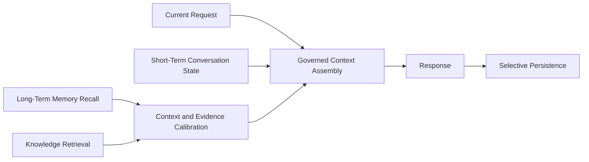

# Memory Governance Flow

## Public Interpretation

Memory is treated as retrieved context. It is not automatic proof, current truth, or authority over the user's latest instruction.

## What Is Not Included

This flow omits private governance prompts, recall scoring, database details, and raw memories.
