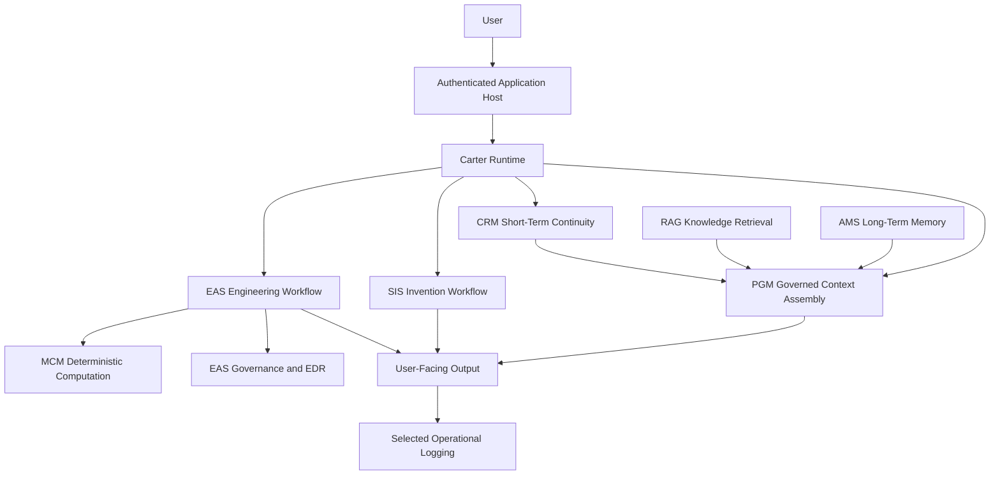

# Synthetic OS High-Level Architecture

## What Is Not Included

This is a conceptual public diagram. It omits routes, function names, storage layouts, credentials, deployment topology, prompt text, and model-routing internals.
