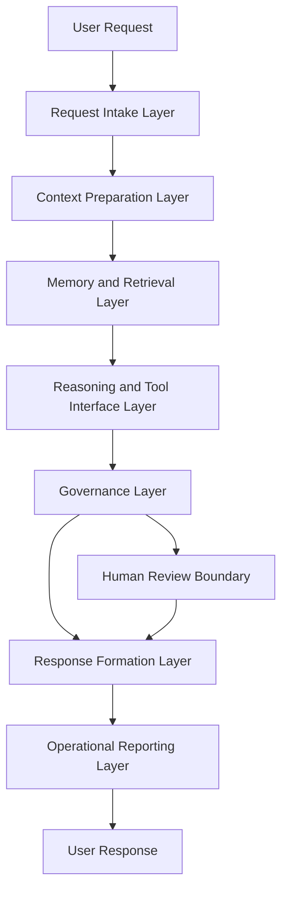
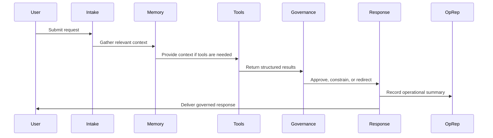

# Architecture Overview

## Purpose

Synthetic OS is an experimental AI systems architecture for building governed, memory-enabled, tool-aware AI agents.

This document provides a high-level public overview of the Synthetic OS architecture and its flagship implementation, **Carter**. It is intended for technical review, portfolio evaluation, and architectural understanding.

This document does not disclose production source code, private prompts, internal memory records, deployment configuration, proprietary orchestration logic, or sensitive operational details.

---

## Architectural Summary

Synthetic OS treats an AI assistant as more than a single model call.

Instead of relying only on a prompt-response interaction, Synthetic OS organizes an AI agent around coordinated system layers:

* Request intake
* Context preparation
* Memory and retrieval
* Tool interface
* Reasoning workflow
* Governance checks
* Response formation
* Operational reporting
* Human review boundaries

The goal is to make AI behavior more structured, traceable, and useful across long-running work.

At a high level, Synthetic OS is designed to support AI agents that can:

* Maintain continuity over time
* Retrieve relevant prior context
* Use tools and specialized subsystems
* Apply governance before response delivery
* Produce operational summaries
* Support human oversight
* Protect private memory and user data

---

## High-Level System Diagram

This diagram is intentionally simplified for public documentation. The production implementation contains additional private safeguards, routing logic, validation steps, and operational controls.

---

## Carter as the Flagship Implementation

**Carter** is the flagship implementation of Synthetic OS.

Carter is a governed AI assistant built to explore how memory, retrieval, operational traceability, and structured response governance can improve the reliability and usefulness of AI systems.

Carter is designed around the following public architectural concepts:

* Persistent memory support
* Retrieval-augmented context
* Structured interaction workflows
* Governed response formation
* Operational reporting
* Human-centered safety boundaries
* Modular connection to specialized systems

Carter is not fully disclosed in this repository. This repository documents Carter at the public architecture level only.

---

## Core Architectural Layers

### 1. Request Intake Layer

The request intake layer receives user input and prepares it for downstream processing.

Its responsibilities include:

* Accepting user requests
* Preserving conversational context
* Identifying the general type of request
* Preparing the request for memory, retrieval, reasoning, and governance layers
* Maintaining a clear boundary between user intent and system execution

The production implementation may include additional private routing, validation, and formatting behavior that is not disclosed here.

---

### 2. Context Preparation Layer

The context preparation layer organizes the information needed to support a useful response.

This may include:

* Current user request
* Relevant conversation history
* Retrieved memory context
* Available tool context
* System constraints
* Task-specific framing
* Safety or review requirements

This layer exists because AI systems often perform better when relevant context is structured before generation or reasoning occurs.

---

### 3. Memory and Retrieval Layer

Synthetic OS includes the concept of layered memory.

At a public level, the memory and retrieval layer supports:

* Short-term conversational continuity
* Long-term recall
* Retrieval of relevant prior context
* Memory hygiene
* Deduplication concepts
* User-governed memory boundaries

The memory layer helps Carter support long-running projects, recurring user goals, and continuity across interactions.

This repository does not disclose:

* Memory database schemas
* Vector store structures
* Retrieval thresholds
* Scoring formulas
* Private memory records
* Raw conversations
* Internal memory module code

The public concept is simple: Carter can retrieve relevant context from prior interactions while respecting privacy and governance boundaries.

---

### 4. Reasoning and Tool Interface Layer

Synthetic OS is designed to support tool-aware AI workflows.

The reasoning and tool interface layer represents the part of the architecture where Carter may coordinate with:

* Retrieval systems
* File analysis tools
* Calculation systems
* Validation systems
* Specialized workflows
* External or local utilities
* Domain-specific modules

This layer helps separate ordinary language generation from structured task execution.

For public documentation purposes, tool use is described conceptually. Production tool wiring, credentials, APIs, internal schemas, and orchestration logic are intentionally excluded.

---

### 5. Governance Layer

The governance layer is responsible for applying system-level constraints before a response is delivered.

At a public level, governance may include:

* Safety checks
* Role boundaries
* Response discipline
* Human-review triggers
* Uncertainty handling
* Sensitive-domain caution
* Refusal or redirection behavior when appropriate
* Separation between raw model output and final user-facing response

Synthetic OS treats governance as an architectural requirement, not as an afterthought.

This repository does not disclose:

* Full governance directives
* Private policy chains
* Internal governance prompts
* Complete decision trees
* Bypass analysis
* Proprietary safety logic

The public principle is that Carter’s output should be governed before it is delivered.

---

### 6. Response Formation Layer

The response formation layer prepares the final user-facing output.

Its responsibilities include:

* Producing a clear response
* Applying formatting rules
* Respecting governance decisions
* Avoiding unnecessary disclosure of internal system details
* Presenting uncertainty when appropriate
* Maintaining a professional and useful interaction style

This layer helps ensure that Carter’s final output is not merely generated text, but a governed response shaped by the broader system architecture.

---

### 7. Operational Reporting Layer

Synthetic OS includes the concept of operational reporting.

Operational reports are used to summarize or trace system activity at a high level. They may support:

* Debugging
* Review
* System evaluation
* Failure analysis
* Workflow traceability
* Development discipline

In the public repository, only sanitized operational reporting examples should be included.

This repository does not include:

* Raw logs
* Backend stack traces
* Local file paths
* Internal job records
* Private model routing details
* User data
* Production operational reports

Operational reporting is part of the architecture because traceability matters when developing long-running AI systems.

---

### 8. Human Review Boundary

Synthetic OS is designed to keep humans in control of important decisions.

The human review boundary represents cases where the system should not act as the final authority.

Human review may be required when:

* Information is incomplete
* The task is sensitive
* The system has low confidence
* Safety implications are present
* Domain expertise is required
* The output could materially affect a real-world decision

Synthetic OS is designed to assist human reasoning and workflow execution, not replace human responsibility.

---

## Request Lifecycle

A simplified Carter request lifecycle is shown below.

This lifecycle is a public simplification. The private implementation may contain additional validation, routing, retries, safety logic, and system-specific controls.

---

## Relationship to Specialized Systems

Synthetic OS is the broader architecture. Carter is the flagship implementation.

Other specialized systems may operate alongside or within the Synthetic OS architecture.

### SIS — Synthetic Ideation System

SIS is a structured ideation workflow focused on governed invention, concept generation, and scientific or technical exploration.

### EAS — Engineer Assistance System

EAS is a structured engineering advisory workflow focused on technical problem-solving, deterministic validation, and engineering report generation.

These systems are referenced only at a high level in this repository. Their private workflows, prompts, validation logic, and implementation details remain proprietary.

---

## Architectural Design Principles

Synthetic OS is guided by several design principles.

### 1. Governance Before Autonomy

AI systems should operate within explicit boundaries. Governance should be part of the architecture, not merely added after generation.

### 2. Memory With Boundaries

Memory can make AI systems more useful, but memory must be controlled, reviewable, and protected.

### 3. Traceability Matters

Long-running AI systems should provide operational visibility. Developers and users should be able to understand what happened at a high level.

### 4. Tool Use Should Be Structured

Tool-aware AI systems should distinguish between language generation, external tool execution, retrieved context, and final response formation.

### 5. Human Responsibility Remains Central

Synthetic OS is designed to assist human judgment. It is not designed to remove accountability from human users.

### 6. Public Transparency Must Not Compromise Security

The public architecture can be documented without exposing private implementation details, credentials, prompts, or user data.

---

## Public / Private Boundary

This repository intentionally includes:

* High-level architecture descriptions
* Conceptual module explanations
* Sanitized examples
* Public design principles
* General request lifecycle diagrams
* Non-sensitive documentation

This repository intentionally excludes:

* Production source code
* Private prompts
* Internal memory databases
* Vector stores
* API keys
* Credentials
* Raw operational logs
* Private governance logic
* Internal validation harnesses
* Deployment details
* Model routing logic
* User conversation data
* Proprietary orchestration logic

This boundary is essential to protect the security, privacy, and intellectual property of Synthetic OS Labs.

---

## Non-Goals

Synthetic OS is not presented here as:

* A conventional computer operating system
* A full open-source software release
* A deployable assistant package
* A prompt collection
* A replacement for human expertise
* A claim of artificial general intelligence
* A complete reproduction of Carter
* A public disclosure of proprietary internals

This repository is a public architecture and portfolio documentation repository.

---

## Development Direction

The ongoing development direction of Synthetic OS includes:

* More reliable governed AI workflows
* Better memory continuity
* Improved operational reporting
* Stronger validation and review boundaries
* Cleaner modular system design
* More useful specialized workflows
* Better public documentation
* Careful separation of public architecture from private implementation

---

## Summary

Synthetic OS is an AI runtime architecture for building governed, memory-enabled, tool-aware agents.

Carter is the flagship implementation of this architecture.

The public architecture emphasizes:

* Memory
* Retrieval
* Governance
* Tool awareness
* Response discipline
* Operational traceability
* Human review
* Privacy-conscious design

This repository documents the system at a high level while protecting the proprietary implementation developed by Synthetic OS Labs.
