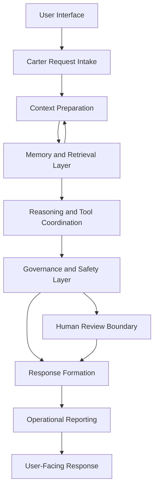
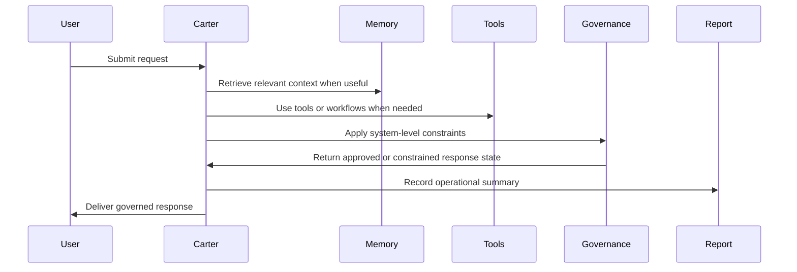

# Carter Implementation Overview

## Purpose

This document provides a public overview of **Carter**, the flagship implementation of the **Synthetic OS** architecture developed by **Synthetic OS Labs**.

Carter is a governed, memory-enabled AI assistant designed to explore how language models can be integrated with memory, retrieval, operational reporting, tool-aware workflows, and human-centered governance.

This document describes Carter at the architectural and implementation-concept level only. It does not disclose production source code, private prompts, internal memory records, deployment configuration, proprietary orchestration logic, credentials, raw logs, or sensitive operational details.

---

## What Carter Is

Carter is the primary working implementation of Synthetic OS.

At a high level, Carter is an AI assistant built around several system-level responsibilities:

* Maintaining useful conversational continuity
* Retrieving relevant prior context
* Supporting structured workflows
* Coordinating with tools and specialized modules
* Applying governance before final response delivery
* Producing operational summaries for review and debugging
* Preserving human oversight for important or uncertain decisions

Carter is not treated as a single prompt-response chatbot. Instead, Carter is implemented as a coordinated AI runtime that combines language-model interaction with memory, retrieval, governance, validation, and reporting layers.

---

## Relationship to Synthetic OS

Synthetic OS is the broader architecture.

Carter is the flagship implementation of that architecture.

Synthetic OS defines the design pattern:

```text
Memory + Retrieval + Tool Awareness + Governance + Operational Traceability
```

Carter applies that pattern as a working AI assistant.

In practical terms:

* **Synthetic OS** is the architecture.
* **Carter** is the implemented agent.
* **SIS** and **EAS** are specialized workflows or systems that can operate alongside or within the broader Synthetic OS environment.

This repository documents the relationship at a high level only. The production implementation remains private.

---

## Implementation Goals

Carter was developed to investigate whether an AI assistant can become more useful and reliable when supported by system layers beyond the base language model.

The core implementation goals include:

1. **Continuity**
   Carter should be able to support long-running work across multiple interactions.

2. **Contextual Recall**
   Carter should retrieve relevant prior context when it improves the quality of the response.

3. **Governed Output**
   Carter should apply system-level boundaries before producing final user-facing responses.

4. **Operational Traceability**
   Carter should support reviewable execution summaries so system behavior can be debugged and improved.

5. **Tool-Aware Workflows**
   Carter should be able to coordinate with supporting tools, files, retrieval systems, validation systems, and specialized workflows.

6. **Human-Centered Design**
   Carter is designed to assist human reasoning and productivity, not replace human judgment or responsibility.

---

## High-Level Carter Architecture



This diagram is a public simplification. The private Carter implementation contains additional routing, validation, memory handling, operational controls, and safeguards that are not disclosed in this repository.

---

## Major Public Components

### 1. User Interface Layer

Carter is accessed through a human-facing interface designed for interactive AI work.

At a public level, the interface supports:

* Submitting requests
* Receiving streamed or generated responses
* Viewing system outputs
* Supporting structured workflows
* Maintaining a clear human-in-the-loop interaction pattern

Private interface implementation details, authentication mechanisms, deployment configuration, and access controls are intentionally excluded from this repository.

---

### 2. Request Intake Layer

The request intake layer prepares user input for Carter’s internal workflow.

Its public responsibilities include:

* Receiving user input
* Preserving the immediate request context
* Preparing the request for memory lookup, reasoning, governance, and response formation
* Supporting structured interaction modes when applicable

This layer helps separate raw user input from downstream system processing.

---

### 3. Context Preparation Layer

The context preparation layer organizes information that may be useful for the response.

This may include:

* The current request
* Relevant conversation history
* Retrieved memory context
* Available tool context
* System-level boundaries
* Workflow-specific framing
* Safety or review considerations

This layer exists because long-running AI work often requires more than the latest message. Carter is designed to prepare context before final response generation.

---

### 4. Memory and Retrieval Layer

Carter uses memory concepts to support continuity and recall.

At a public level, Carter’s memory system is designed to support:

* Short-term conversational continuity
* Long-term contextual recall
* Retrieval of relevant prior information
* Memory hygiene
* Deduplication concepts
* User-governed memory boundaries

Memory helps Carter maintain project continuity, remember prior decisions, and support ongoing work more effectively.

This repository does not disclose:

* Memory database schemas
* Vector database structures
* Retrieval thresholds
* Scoring formulas
* Private memory records
* Raw conversations
* Internal memory module source code
* Private user data

The public principle is that Carter can use governed memory to improve continuity while protecting private information.

---

### 5. Reasoning and Tool Coordination Layer

Carter is designed to coordinate with tools and specialized workflows when needed.

At a public level, this layer may support:

* File-informed reasoning
* Retrieval-augmented context
* Calculation support
* Validation workflows
* Structured advisory processes
* Specialized subsystem interaction
* Domain-specific workflows

The goal is to separate ordinary conversational output from structured task execution.

This repository does not disclose private tool wiring, production APIs, credentials, internal schemas, model routing logic, or proprietary orchestration code.

---

### 6. Governance and Safety Layer

Carter includes a governance layer intended to shape or constrain final output.

At a public level, governance may include:

* Safety boundaries
* Role boundaries
* Response discipline
* Human-review triggers
* Sensitive-domain caution
* Uncertainty handling
* Refusal or redirection when appropriate
* Separation between raw model output and final user-facing response

The governance layer is a core part of Carter’s design. Carter is not intended to simply emit raw model output without review or shaping.

This repository does not disclose:

* Full governance directives
* Private governance prompts
* Complete decision trees
* Internal safety chains
* Bypass analysis
* Proprietary control logic

---

### 7. Response Formation Layer

The response formation layer prepares Carter’s final user-facing answer.

Its responsibilities include:

* Producing clear responses
* Applying formatting expectations
* Respecting governance decisions
* Avoiding disclosure of private system internals
* Communicating uncertainty when appropriate
* Supporting useful, professional interaction
* Maintaining alignment with the user’s task

This layer helps ensure that Carter’s final output is not just generated text, but a governed response shaped by the broader system.

---

### 8. Operational Reporting Layer

Carter uses operational reporting concepts to support traceability, debugging, and review.

At a public level, operational reporting may summarize:

* Request type
* Processing stage
* Memory involvement
* Tool involvement
* Governance state
* Response status
* Review requirements
* Error or warning conditions

Only sanitized operational examples should be published in this repository.

This repository does not include:

* Raw backend logs
* Stack traces
* Local file paths
* Internal job records
* Private model routing details
* Private user data
* Production operational reports
* Sensitive validation traces

Operational reporting is included because traceability matters when developing AI systems intended for long-running, structured work.

---

## Simplified Request Lifecycle

A simplified Carter interaction follows this general pattern:



This lifecycle is simplified for public documentation. The actual implementation may contain additional private routing, retries, validation, logging, context management, and safety mechanisms.

---

## Carter and Specialized Workflows

Carter can operate as a general governed AI assistant, but it can also support specialized workflows.

Two important related systems are:

### SIS — Synthetic Ideation System

SIS is a governed ideation workflow designed to support structured invention, concept exploration, and technical reasoning.

Carter may support SIS-related interaction by helping frame, review, or process ideation tasks at a high level.

### EAS — Engineer Assistance System

EAS is a governed engineering advisory workflow designed to support technical problem-solving, structured engineering reports, deterministic computation, and validation-oriented advisory output.

Carter may support EAS-related interaction by assisting with engineering workflow preparation, review, or documentation.

The proprietary implementation of SIS and EAS is not disclosed in this repository.

---

## Implementation Characteristics

Carter is designed with several important implementation characteristics.

### Local-First Orientation

Carter was designed with a local-first and privacy-conscious orientation where feasible.

This means the architecture values:

* User control
* Local data boundaries
* Reduced unnecessary exposure of private information
* Clear separation between private runtime data and public documentation

This repository does not disclose deployment details, local host configuration, private endpoints, credentials, or access methods.

---

### Modular System Design

Carter is organized conceptually as a modular system rather than a monolithic chatbot.

Public module categories include:

* Interface layer
* Request intake
* Context preparation
* Memory and retrieval
* Tool coordination
* Governance
* Response formation
* Operational reporting

The internal module structure, code organization, schemas, prompts, and orchestration mechanisms remain private.

---

### Human-in-the-Loop Operation

Carter is designed to support human decision-making.

The system may assist with reasoning, summarization, drafting, technical review, ideation, and structured workflows, but the user remains responsible for important decisions.

Human review is especially important when:

* Information is incomplete
* A task is safety-sensitive
* A task has legal, financial, medical, engineering, or operational consequences
* The system expresses uncertainty
* The output requires domain expertise
* The result could affect real-world action

---

### Traceable Development

Carter’s development emphasizes traceability.

Operational reporting and workflow summaries help support:

* Debugging
* Regression review
* System improvement
* Behavior analysis
* Reliability work
* Documentation of important changes

The public repository may include sanitized examples of this traceability, but it must not include raw logs or private traces.

---

## Public Capability Summary

At a high level, Carter is designed to support:

| Capability               | Public Description                                       |
| ------------------------ | -------------------------------------------------------- |
| Memory continuity        | Maintains useful context across interactions             |
| Retrieval                | Finds relevant prior information when helpful            |
| Governance               | Applies boundaries before final response delivery        |
| Tool awareness           | Coordinates with supporting tools or workflows           |
| Operational reporting    | Produces reviewable summaries of system activity         |
| Structured workflows     | Supports specialized systems such as SIS and EAS         |
| Human review             | Preserves human responsibility for important decisions   |
| Privacy-conscious design | Separates public documentation from private runtime data |

This table is a conceptual overview, not a disclosure of production implementation details.

---

## Public / Private Boundary

This document intentionally includes:

* High-level Carter architecture
* Public module descriptions
* Conceptual request lifecycle
* Non-sensitive workflow summaries
* Public design principles
* Sanitized implementation framing

This document intentionally excludes:

* Production Carter source code
* Private prompts
* Prompt chains
* Internal memory records
* Memory database schemas
* Vector store configuration
* API keys
* Credentials
* Deployment configuration
* Model routing logic
* Raw logs
* Private operational reports
* Internal validation harnesses
* Proprietary governance logic
* Sensitive screenshots
* User conversation data

The goal is to make Carter understandable for public review while protecting the private implementation developed by Synthetic OS Labs.

---

## What Carter Is Not

Carter should not be interpreted as:

* A claim of artificial general intelligence
* A conscious AI system
* A replacement for human judgment
* A fully autonomous operator
* A public source-code release
* A deployable open-source assistant package
* A prompt library
* A complete reproduction of the private Synthetic OS runtime

Carter is best understood as a governed AI assistant implementation within the broader Synthetic OS architecture.

---

## Current Development Direction

Carter development continues to focus on:

* Improving memory continuity
* Improving retrieval usefulness
* Strengthening governance boundaries
* Improving operational reporting
* Supporting structured technical workflows
* Refining human review triggers
* Improving public documentation
* Preserving the public/private implementation boundary

---

## Summary

Carter is the flagship implementation of Synthetic OS.

It is designed as a governed, memory-enabled, tool-aware AI assistant that combines language model interaction with system-level architecture for context, retrieval, governance, response discipline, and operational traceability.

This repository documents Carter publicly at the architecture level while keeping the production implementation, private prompts, memory data, governance logic, and orchestration code proprietary to Synthetic OS Labs.
