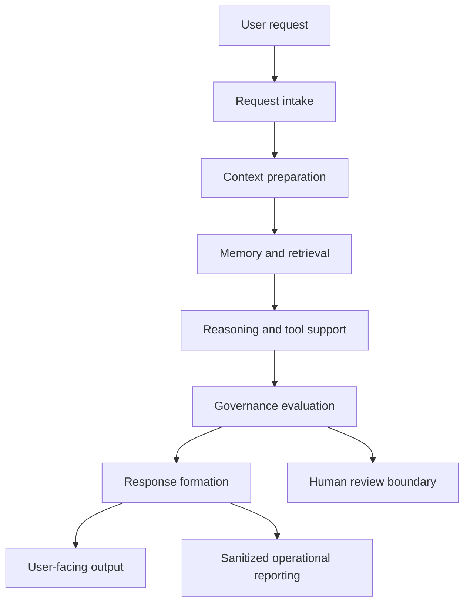
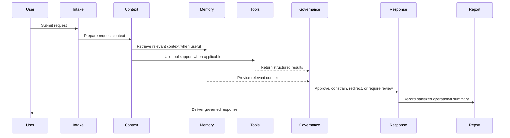

# Public Governance Model

## 1. Purpose

This document describes the public governance model for Synthetic OS and
Carter, the flagship implementation of the Synthetic OS architecture.

It is intended for public GitHub review by recruiters, engineering managers,
AI researchers, software engineers, and prospective collaborators. It explains
governance at the architecture level only.

This document does not disclose production source code, private prompts, full
governance directives, internal decision trees, private validation harnesses,
raw logs, private operational reports, user data, credentials, deployment
configuration, model routing behavior, or proprietary orchestration logic.

## 2. Why Governance Exists in Synthetic OS

Synthetic OS is described in this repository as an experimental AI systems
architecture for building governed, memory-enabled, tool-aware AI agents.
Governance exists because the system is not intended to be a simple
prompt-response interface or an unconstrained autonomous actor.

At the public architecture level, governance helps Carter:

- Apply system-level boundaries before final response delivery
- Keep memory, retrieval, tools, validation, and reporting within controlled
  roles
- Preserve human oversight for important or uncertain decisions
- Avoid treating raw model output as the final user-facing answer
- Handle uncertainty and sensitive contexts with discipline
- Protect private memory, user data, prompts, logs, and implementation details
- Support traceability through sanitized operational reporting

The public purpose of governance is bounded, reviewable assistance. It is not a
claim of perfect safety, guaranteed correctness, consciousness, artificial
general intelligence, or autonomous moral authority.

## 3. Source-of-Truth Note

This document is based only on files currently present in this repository:

- `README.md`
- `docs/architecture_overview.md`
- `docs/carter_implementation_overview.md`
- `docs/design_principles.md`
- `docs/memory_model_public.md`
- `SECURITY.md`
- `CONTRIBUTING.md`
- `NOTICE.md`
- `AGENTS.md`

The current public repository contains documentation, not production Carter
source code. Searches did not find code-level governance classes, functions,
routes, prompts, configuration files, or validators. The public governance model
therefore describes documented architecture layers and responsibilities, not
undisclosed implementation modules.

If a detail is not present in these files, it is not described here as
confirmed architecture.

## 4. Public Governance Architecture

The repository documents governance as part of a broader AI runtime
architecture. The relevant public layers are:

- Request intake
- Context preparation
- Memory and retrieval
- Reasoning and tool interface or coordination
- Governance layer, also described as governance and safety
- Response formation
- Operational reporting
- Human review boundary

These are public architecture layers, not disclosures of private class names,
source files, internal prompts, exact control flow, or production module
boundaries.

This diagram is a public simplification. It does not expose real production
control flow, hidden prompts, private validators, model routing, storage
operations, thresholds, or proprietary orchestration.

## 5. Governance Principles

The repository supports the following public governance principles.

### Governance Before Autonomy

Governance is described as a core architectural layer rather than an optional
afterthought. Synthetic OS is designed to operate within defined boundaries,
apply safety checks, respect user intent, and route uncertain or sensitive
situations toward human review when appropriate.

### Separation Between Generation and Final Output

The public docs state that Synthetic OS separates raw model interaction from
governed response formation. Carter's final response is not described as raw
model output; it is shaped by system-level responsibilities before delivery.

### Human Responsibility Remains Central

Carter is described as assisting human reasoning and productivity, not
replacing human judgment. The public architecture preserves human review for
important, uncertain, sensitive, or high-impact decisions.

### Memory With Boundaries

Memory is described as useful for continuity and recall, but controlled,
privacy-conscious, bounded, and user-governed. Retrieved context is not
presented as an unquestionable source of truth.

### Structured Tool Use

Tool use is described as structured and governed. The architecture separates
language generation from tool-aware execution, validation concepts, retrieved
context, and final response formation.

### Traceability Without Exposure

Operational reporting is described as supporting review, debugging, workflow
traceability, and system improvement. Public documentation may include only
sanitized summaries or examples, not raw logs or private operational reports.

## 6. Governance in the Carter Request Lifecycle

The public lifecycle described in this repository follows a simplified pattern:

1. A user submits a request.
2. The request intake layer receives and prepares the request.
3. Context preparation organizes relevant information.
4. Memory and retrieval may provide prior context when useful.
5. Tool-aware or validation-oriented workflows may be involved when applicable.
6. Governance applies system-level constraints before final response delivery.
7. Response formation prepares the user-facing answer.
8. Operational reporting may record a sanitized summary.
9. Human review may be required or appropriate for sensitive, uncertain, or
   high-impact cases.

This lifecycle is intentionally high level. The repository does not disclose
private routing, retries, hidden prompts, scoring rules, policy chains, exact
validators, or production execution order.

The sequence diagram is conceptual only.

## 7. Response Formation and Output Discipline

The response formation layer prepares Carter's final user-facing answer. The
repository describes this layer as responsible for:

- Producing clear responses
- Applying formatting expectations
- Respecting governance decisions
- Avoiding unnecessary disclosure of internal system details
- Communicating uncertainty when appropriate
- Supporting useful, professional interaction
- Maintaining alignment with the user's task

This means Carter's output is publicly described as governed response
formation, not merely raw generated text. The repository does not disclose the
private prompts, response templates, hidden instructions, exact checks, or
post-processing logic used by the production implementation.

## 8. Memory Governance

Memory governance is supported by the public docs as a conceptual
responsibility. The repository describes memory as governed, bounded,
privacy-conscious, useful for continuity, and subject to user control.

At the public level, memory governance means:

- Retrieved context should be relevant to the current request.
- Memory should support continuity without overriding current user
  instructions.
- Sensitive or private information should not be exposed in public outputs.
- Memory should be protected from uncontrolled accumulation.
- Memory-related examples must be sanitized.
- The public repository must not include memory databases, vector stores,
  private memory records, raw conversations, or internal memory module code.

The repository does not disclose memory schemas, retention workflows, retrieval
thresholds, scoring formulas, vector store structures, or exact memory
governance logic.

## 9. Tool-Use Governance

Synthetic OS is described as tool-aware, but public documentation treats tool
use as a controlled architecture concept rather than a disclosed production
integration.

At the public level, tool-use governance means:

- Tool use should be structured rather than blended into ordinary language
  generation.
- Tool outputs should remain distinguishable from generated language and final
  advice.
- Validation may be used where appropriate.
- Human review remains important for uncertain or sensitive tool-assisted
  results.
- External or local capabilities should be used with privacy and safety
  boundaries.

The repository does not disclose production tool wiring, credentials, private
APIs, internal schemas, model routing behavior, deployment details, or
proprietary orchestration.

## 10. Human Review Boundary

The human review boundary is a documented part of the public architecture.
Carter is designed to assist human users, not replace human responsibility.

Human review may be required or appropriate when:

- Information is incomplete
- A task is sensitive
- The system has low confidence or expresses uncertainty
- Safety implications are present
- Domain expertise is required
- The output could materially affect a real-world decision
- Legal, financial, medical, engineering, or operational consequences may be
  involved

The public model does not define exact review triggers, escalation thresholds,
or private decision procedures.

## 11. Operational Reporting and Traceability

The repository describes operational reporting as a public architecture layer
that supports traceability, debugging, review, system evaluation, failure
analysis, workflow accountability, and system improvement.

The term `OpRep` appears in public lifecycle diagrams as a label for
operational reporting. In this public document, it is treated only as a
high-level reporting concept.

Operational reporting may summarize public-safe information such as:

- Request type
- Processing stage
- Memory involvement
- Tool involvement
- Governance state
- Response status
- Review requirements
- Error or warning conditions

Only sanitized operational examples belong in this repository. Raw logs, raw
operational reports, backend traces, local paths, internal job records, private
model routing details, private validation traces, and user data are outside the
public boundary.

## 12. Safety and Privacy Boundaries

The repository's public security guidance defines a strict disclosure boundary.
Public governance documentation may describe high-level architecture, public
diagrams, conceptual module summaries, design principles, and sanitized
examples.

Public documentation must not expose:

- Secrets, API keys, credentials, tokens, or environment files
- Production source code
- Private prompts or prompt chains
- Full governance directives
- Internal policy chains
- Raw logs or backend traces
- Raw or private operational reports
- Memory databases or vector stores
- User conversation data
- Deployment or tunnel configuration
- Model routing behavior
- Proprietary orchestration logic
- Private governance or validation logic
- Security-sensitive implementation details

When a detail is uncertain, the repository guidance is to keep it high-level,
sanitize further, or keep it private.

## 13. What This Repository Does Not Disclose

This repository does not disclose the private governance implementation.
Specifically, it does not disclose:

- Governance source code
- Governance class or function names
- Complete directive sets
- Private governance prompts
- Evaluator prompts
- Internal safety chains
- Complete decision trees
- Refusal bypass analysis
- Security-sensitive test cases
- Exact validators or validation harnesses
- Exact thresholds or scoring rules
- Model routing behavior
- Production logging formats
- Raw operational reports
- Private operational traces
- Internal Carter runtime logic

The absence of these details is intentional. The repository is meant to explain
the public architecture while protecting private implementation details.

## 14. Sanitized Example

The following example is fictional and sanitized.

A user asks Carter to draft a public architecture summary for this repository.
The request intake layer receives the task, context preparation identifies that
the repository is public-facing, and memory or retrieval may provide relevant
public documentation context. If tool support is used, its output is treated as
supporting information rather than final advice.

Governance then constrains the response:

- Keep the summary grounded in files present in the repository.
- Avoid private prompts, internal memory details, raw logs, operational traces,
  credentials, deployment details, and proprietary orchestration logic.
- Use public-safe language.
- State uncertainty when implementation details are missing.
- Preserve human review for final publication.

Response formation then produces a clear user-facing answer. Operational
reporting may record a sanitized summary that documentation work occurred, but
it must not expose raw logs, private records, local paths, or private
operational details.

## 15. Design Principles

The public governance model is based on the following principles:

- Governance before autonomy
- Bounded AI behavior
- Human-centered decision-making
- Safety-aware response formation
- Review boundaries for sensitive tasks
- Clear separation between generation and final response delivery
- Memory that is useful, controlled, and respectful
- Structured and reviewable tool use
- Traceability without private disclosure
- Public transparency without exposing private implementation
- Reliability through architecture, not only model capability
- Continuous review and improvement

These principles are public architectural commitments, not guarantees of
perfect behavior.

## 16. Non-Goals

The public governance model is not:

- A production implementation guide
- A source-code disclosure
- A prompt library
- A complete policy manual
- A full directive set
- A validation harness specification
- A model-routing guide
- A deployment guide
- A guarantee of perfect safety
- A guarantee of factual correctness
- A claim of artificial general intelligence
- A claim of consciousness or sentience
- A replacement for human judgment
- A disclosure of proprietary Carter internals

## 17. Summary

The public repository supports a governance model in which Carter's final
output is shaped by documented system responsibilities: request intake, context
preparation, memory and retrieval, structured tool use, governance evaluation,
response formation, operational reporting, and human review boundaries.

The confirmed public governance architecture is conceptual and high level. It
does not include production code, private prompts, full directives, hidden
policy chains, exact validators, raw logs, private operational reports, or
implementation-sensitive details.

Governance in Synthetic OS is best understood as a public architectural
principle: Carter is designed to assist users through bounded, traceable,
privacy-conscious, human-centered response formation rather than uncontrolled
raw model output.
