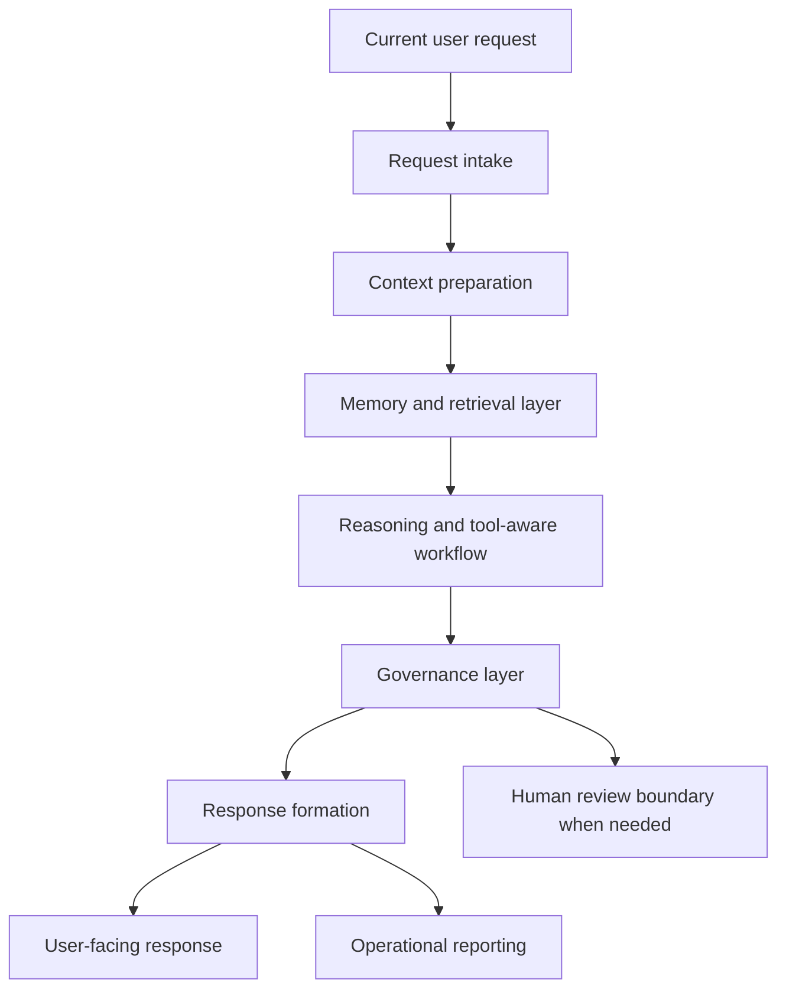

# Public Memory Model

## Purpose

This document describes the public memory model for Synthetic OS and Carter,
the flagship implementation of the Synthetic OS architecture.

It is grounded only in files present in this repository. The repository is a
public architecture and documentation repository, not the production source
tree for Synthetic OS or Carter. It does not contain implementation code,
private prompts, memory databases, vector stores, raw logs, operational traces,
or private runtime details.

Where this repository does not specify an architecture detail, this document
states that the detail is not specified.

## Source Basis

This document is based on the public descriptions in:

- `README.md`
- `docs/architecture_overview.md`
- `docs/carter_implementation_overview.md`
- `docs/design_principles.md`
- `SECURITY.md`
- `CONTRIBUTING.md`
- `NOTICE.md`

Those files describe Synthetic OS and Carter at a high level. They support a
conceptual memory and retrieval model, but they do not disclose the private
memory implementation.

## Public Summary

Synthetic OS is described as an experimental AI systems architecture for
building governed, memory-enabled, tool-aware AI agents. Carter is described as
the flagship implementation of that architecture.

At the public architecture level, memory is one layer in a broader governed AI
runtime. It is described as supporting continuity, relevant recall, retrieval
of prior context, long-running work, and user-governed boundaries. Memory is
not presented as a standalone authority, a raw transcript archive, or a public
database.

The public model can be summarized as:

```text
Current request
  -> request intake
  -> context preparation
  -> memory and retrieval
  -> reasoning and tool-aware workflow, when applicable
  -> governance
  -> response formation
  -> operational reporting
  -> user-facing response
```

This flow is conceptual. The repository does not disclose the production
control flow, routing logic, storage mechanisms, prompts, model configuration,
or operational implementation.

## Supported Public Concepts

### Layered Memory

The public documentation states that Synthetic OS includes the concept of
layered memory. It also describes Carter's memory system as supporting:

- Short-term conversational continuity
- Long-term recall
- Retrieval of relevant prior context
- Memory hygiene
- Deduplication concepts
- User-governed memory boundaries

The repository does not define concrete public module names, storage classes,
schemas, tables, collections, or implementation boundaries for those functions.
They should therefore be treated as architectural capabilities, not as disclosed
production components.

### Continuity

Memory is described as a way to support long-running work across interactions.
Public examples include maintaining project continuity, remembering prior
decisions when relevant, and reducing the need to restate stable context.

The repository does not specify exactly how short-term continuity is stored,
expired, ranked, or recovered.

### Retrieval

The public architecture includes a memory and retrieval layer. Retrieval is
described as finding relevant prior context when it can improve a response.

The repository does not disclose retrieval thresholds, scoring formulas,
embedding configuration, vector store structure, ranking algorithms, or exact
context assembly rules.

### Memory Hygiene and Deduplication

The public docs mention memory hygiene and deduplication as concepts. At a
public level, this means memory should remain useful, bounded, and respectful
rather than becoming uncontrolled data accumulation.

The repository does not specify the deduplication algorithm, retention policy,
review workflow, or memory update mechanism used by the private implementation.

### User-Governed Boundaries

The design principles describe memory as controlled, privacy-conscious, and
respectful of user control. Current user instructions and human review remain
central to the system's public design.

The repository does not specify the exact user interface, access-control model,
memory editing workflow, deletion workflow, or administrative controls for
production memory.

### Governance Before Output

Synthetic OS is described as a governed architecture. Memory and retrieved
context are part of the system context, but public documentation presents
governance as a required layer before final response delivery.

At the public level, this means remembered or retrieved context should be
considered against relevance, privacy, safety, uncertainty, and the current
user request. The repository does not disclose private governance prompts,
policy chains, decision trees, or proprietary safety logic.

### Operational Reporting

The public architecture includes operational reporting for traceability,
debugging, review, and system improvement. The README and architecture docs
show operational reporting as part of the request lifecycle.

For memory-related work, operational reporting may be described only at a
sanitized, high level. The repository does not include raw operational reports,
backend logs, stack traces, private traces, internal job records, local file
paths, or private user data.

## Conceptual Public Diagram



This diagram is a public simplification. It does not represent the private
production implementation.

## Public Memory Behavior

Based on the repository's public documentation, a memory-enabled Carter
interaction can be described as follows:

1. A user submits a request.
2. Carter prepares context for the request.
3. Relevant memory or prior context may be retrieved when useful.
4. Tool-aware or structured workflows may be involved when applicable.
5. Governance is applied before the final response is delivered.
6. A sanitized operational summary may support review or debugging.
7. The user receives a governed response.

This lifecycle is intentionally high level. The repository does not provide
enough information to describe exact production sequencing, retries, prompts,
model routing, storage operations, or validation internals.

## Sanitized Example

The following example is fictional and sanitized.

A user returns to a long-running documentation project and asks Carter to update
a public architecture page. The memory and retrieval layer may help identify
that the repository is public-facing, that private implementation details must
not be disclosed, and that documentation should remain concise and
professional. Governance then constrains the response so it avoids private
prompts, raw logs, memory data, credentials, deployment details, or proprietary
orchestration logic.

This example illustrates the public concept only. It does not disclose real
memory contents, real user data, production prompts, private operational
reports, or implementation logic.

## Explicitly Not Specified

The following memory architecture details are not specified in this repository:

- Concrete memory module names
- Database schemas or table layouts
- Vector store structure
- Collection names
- Embedding models or embedding configuration
- Retrieval thresholds or similarity scores
- Ranking algorithms
- Prompt chains or hidden directives
- Memory write, update, deletion, or retention workflows
- Ingestion pipelines
- Access-control implementation
- Production logging formats
- Operational report schemas
- Model routing behavior
- Deployment topology
- Internal Carter runtime logic

Any future public documentation that discusses these topics should either stay
conceptual or be reviewed by the maintainer for public release.

## Public / Private Boundary

This document may describe:

- High-level memory concepts
- Public architecture layers
- Sanitized examples
- Public design principles
- Public privacy and governance expectations

This document must not include:

- Production source code
- Private prompts
- Internal memory records
- Memory database contents
- Vector store contents
- Raw conversations
- Raw operational logs
- Private operational reports
- Credentials or environment files
- Local paths or infrastructure details
- Proprietary orchestration logic
- Private governance logic
- User conversation data

This boundary is part of the repository's purpose: to make the public
architecture understandable without exposing proprietary Synthetic OS or Carter
internals.

## Non-Goals

The public memory model is not:

- A production implementation guide
- A database specification
- A prompt library
- A memory export format
- A transcript archive
- A deployment guide
- A claim of perfect recall
- A guarantee of factual correctness
- A replacement for human review
- A disclosure of proprietary Carter internals

## Summary

The repository supports a public memory model in which Synthetic OS and Carter
use governed memory and retrieval to improve continuity, recall relevant prior
context, support long-running work, and preserve human-centered boundaries.

The public documentation does not disclose how the private memory system is
implemented. Architecture details such as schemas, storage systems, scoring
rules, prompts, routing behavior, and operational internals remain unspecified
and private.
