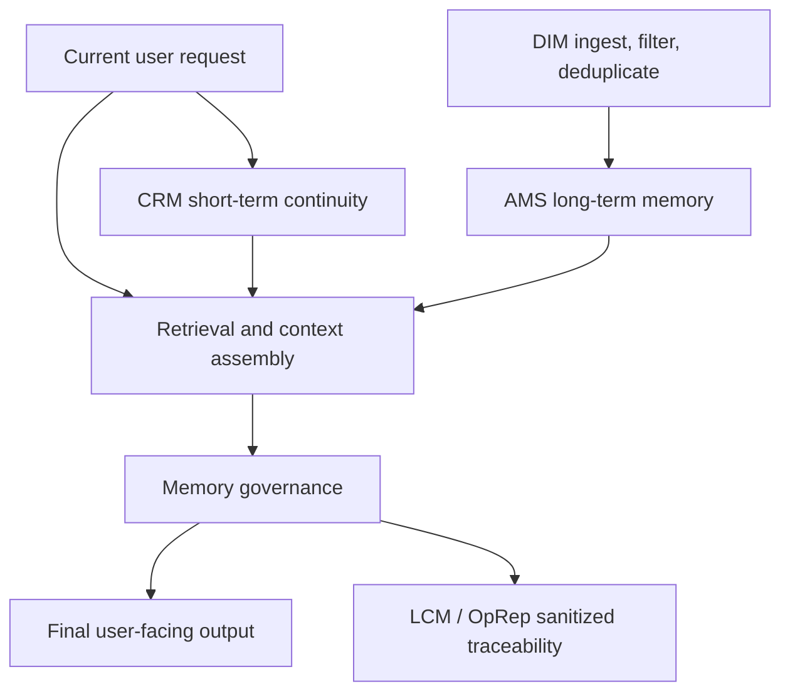
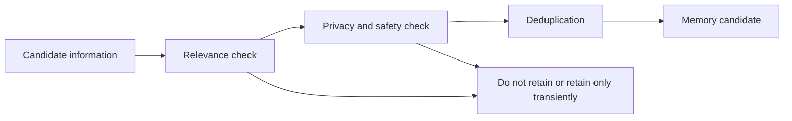
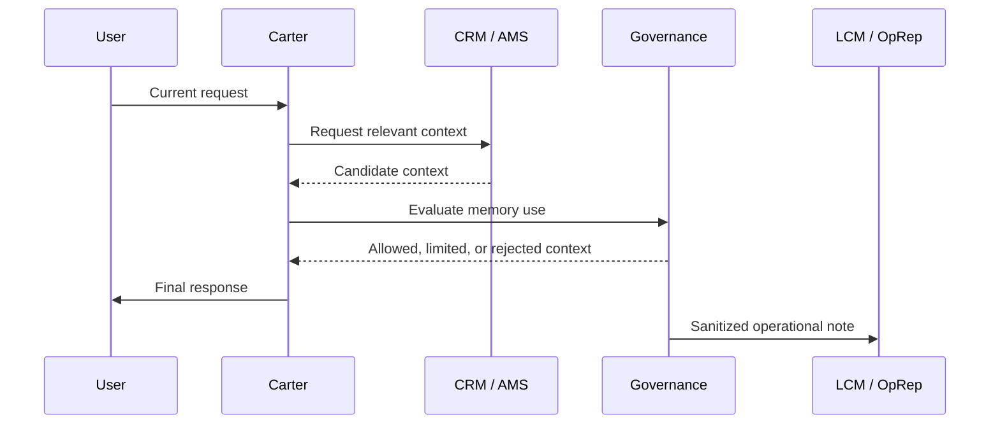

# Public Memory Model

## 1. Purpose

This document describes the public memory model for Synthetic OS and Carter.
Carter is the flagship implementation of Synthetic OS, and its memory
architecture is designed around layered continuity, governed recall, and
public-safe operational traceability.

This is not a generic discussion of chatbot memory. It is a public architecture
disclosure for how Synthetic OS treats memory as an engineered system component
rather than as an unstructured accumulation of chat history.

This repository is a public architecture disclosure repository. It does not
include production source code, database layouts, storage details, private
governance prompts, raw logs, user records, or implementation details that would
allow reconstruction of the private Synthetic OS or Carter system.

## 2. Why Memory Exists in Synthetic OS

Synthetic OS uses memory because long-running technical work often cannot be
handled well by a single chat window. Projects evolve across many sessions:
repository development, engineering decisions, career materials, architecture
work, research notes, and system design discussions all require continuity.

In Synthetic OS, memory exists to support:

- Continuity across long-running projects
- Recall of prior technical context when it is relevant
- Recovery from session boundaries and conversation length limits
- Better handling of repository and architecture work over time
- Reduced repetition for stable user preferences, project facts, and active
  workstreams
- More coherent support for career materials, engineering planning, and
  multi-step technical development

Memory is not treated as an unquestionable source of truth. Retrieved memory is
contextual support. It must still be interpreted against the current request,
the visible conversation, user instructions, safety constraints, and
governance rules.

## 3. Public Memory Architecture

At a public level, Carter's memory architecture includes six conceptual areas:

1. CRM, or Conversation Recovery Module, for short-term conversational
   continuity.
2. AMS, or Active Memory System, for long-term durable memory and recall.
3. DIM, or Data Ingestion Module, for ingestion, filtering, and deduplication.
4. Retrieval and context assembly, which prepares relevant memory context for
   the current request.
5. Governance over memory use, which constrains how memory can influence
   output.
6. LCM / OpRep operational reporting, which supports sanitized traceability
   without disclosing raw logs or private records.

The following diagram is intentionally high-level and public-safe:

This public model does not disclose schemas, collection names, embedding
configuration, retrieval thresholds, similarity scores, storage locations,
prompt chains, internal governance prompts, model-routing behavior, or
production source code.

## 4. CRM - Conversation Recovery Module

CRM is Carter's short-term continuity layer. Its purpose is to preserve and
recover the active conversational working state around the current interaction.

At a public level, CRM helps Carter answer questions such as:

- What has the user been trying to accomplish in the current workstream?
- What constraints or preferences have already been established recently?
- What files, documents, repository areas, or topics have been under active
  discussion?
- What unresolved actions, assumptions, or open decisions are still relevant?

CRM is not intended to be the full durable memory of the system. It is closer to
a continuity layer around the active session or workstream. It helps reduce
loss of context when a discussion is long, interrupted, or resumed.

CRM may support:

- Short-term task continuity
- Recovery after conversation interruption
- Preservation of active project framing
- Carryover of immediate constraints and next steps
- Distinction between current-session facts and older durable memory

CRM does not grant Carter autonomous authority. It does not make memory
infallible, and it does not override direct user instructions.

## 5. AMS - Active Memory System

AMS is Carter's long-term memory layer. Its purpose is durable recall of
relevant context across sessions and projects.

At a public level, AMS supports memory for:

- Long-running repository development
- Technical architecture discussions
- Repeated engineering workflows
- Career materials and professional documents
- User-stated preferences and stable context
- System design notes and project history
- Reusable summaries of prior decisions, when appropriate

AMS is not a raw transcript archive. Publicly, it should be understood as a
durable memory and recall layer that can supply relevant context when the
current request benefits from prior project or user context.

AMS memory is bounded. It should be used only when relevant, safe, privacy
appropriate, and consistent with user control. It should not be treated as
perfect recall, a source of autonomous decision-making authority, or a
substitute for human review.

The long-term layer exists because many useful facts are too persistent for a
single conversation but too contextual to belong in static documentation. Carter
uses AMS to help bridge that gap at the architecture level.

## 6. DIM - Data Ingestion Module

DIM is the public architectural concept for ingestion, filtering, and
deduplication before information becomes useful memory.

At a high level, DIM exists because not every piece of conversation or project
data should become durable memory. Some information may be redundant,
temporary, private, irrelevant, unsafe to retain, or superseded by newer
context.

DIM can be described publicly as the layer that helps answer:

- Is this information appropriate to consider for memory?
- Is it relevant beyond the immediate exchange?
- Is it duplicative of existing memory?
- Is it stale, conflicting, or superseded?
- Should it be retained, summarized, ignored, or handled only transiently?

DIM is not disclosed here as source code, a database pipeline, an embedding
configuration, or a rule table. The public point is architectural: Synthetic OS
does not treat memory as a direct dump of conversation text. Information passes
through an ingest and deduplication concept before it can function as durable
memory support.

This diagram is conceptual only. It does not represent private control flow,
internal prompts, thresholds, database writes, or implementation logic.

## 7. Retrieval and Context Assembly

Memory retrieval is the process of finding potentially relevant memory and
assembling it into usable context for the current request.

Retrieval is not the same as final reasoning. It is an upstream support step.
The retrieved material must still be evaluated, constrained, and integrated
with the current task.

At a public level, retrieval and context assembly are responsible for:

- Identifying memory that may be relevant to the current request
- Separating short-term continuity from long-term recall
- Assembling a concise context package
- Avoiding unnecessary or unrelated memory injection
- Preserving the priority of current user instructions
- Supporting task continuity without overwhelming the response

The output of retrieval should be treated as contextual evidence, not as
unquestionable truth. Memory may be incomplete, outdated, superseded, or
irrelevant to the current user intent. Carter's architecture therefore treats
retrieval as a support layer that must pass through governance before it
influences final output.

## 8. Governance of Memory Use

Memory use is governed before it influences final output. This is a central
design point in Synthetic OS.

At a public level, memory governance asks:

- Is the memory relevant to the current request?
- Is the memory safe to use in this context?
- Is the memory consistent with current user instructions?
- Does the memory create privacy risk?
- Could the memory be stale, ambiguous, or contradicted by the current
  conversation?
- Should the system disclose uncertainty or ask for clarification?
- Should the memory be ignored for this response?

Governance is necessary because memory can improve continuity but can also
introduce risk. A remembered detail can be wrong, outdated, private, or
misapplied. Carter is therefore designed so memory is bounded by privacy,
relevance, safety, and user control.

Publicly, this repository discloses the existence and purpose of memory
governance. It does not disclose internal governance prompts, private directive
sets, evaluator logic, scoring methods, prompt chains, or implementation
details.

## 9. Operational Reporting and Memory Traceability

Synthetic OS includes operational reporting and logging concepts through
LCM / OpRep. In the public memory model, these concepts support sanitized
traceability around system behavior.

At a public level, operational traceability may help describe:

- That memory-assisted processing occurred
- Which public architectural layer was involved
- Whether context was treated as short-term continuity or long-term recall
- Whether governance was applied before final output
- Whether a public-safe summary of the operation can be reviewed

Raw operational records are not disclosed. Public documentation must not expose
raw OpReps, logs, conversation records, private user memories, file paths,
storage locations, secrets, API keys, internal prompts, or production source
code.

The public role of LCM / OpRep is traceability in sanitized form. It is not a
public log dump and not a disclosure of private operational internals.

The sequence diagram shows the public concept only. It does not disclose private
message formats, exact control flow, prompt content, model routing, or storage
mechanisms.

## 10. User Control and Privacy

Memory in Synthetic OS is bounded by user control and privacy. The system should
support continuity without converting every interaction into permanent context
and without treating private information as public documentation.

At a public architecture level, this means:

- Current user instructions take priority over remembered context.
- Sensitive or private information should not be exposed in public outputs.
- Memory should be relevant to the task being handled.
- Memory should not be used to surprise the user with unrelated recall.
- Users should be able to correct, supersede, or constrain remembered context.
- Public documentation must use sanitized examples rather than real user
  records.

Carter's memory model is intended to support the user, not to create an
independent authority over the user. Memory assists continuity, but the user
remains the controlling party for goals, corrections, constraints, and final
review.

## 11. Memory Hygiene

Memory hygiene is the practice of keeping memory useful, bounded, and
appropriate over time.

At a public level, memory hygiene includes:

- Avoiding unnecessary retention of transient details
- Deduplicating repeated facts or summaries
- Treating superseded information as lower confidence
- Distinguishing durable project facts from temporary working assumptions
- Avoiding broad recall when narrow context is sufficient
- Keeping sensitive material out of public examples
- Preserving uncertainty when memory is incomplete or stale

Memory hygiene is one reason Synthetic OS separates CRM, AMS, DIM, retrieval,
governance, and operational traceability. Each layer has a different role, and
that separation helps prevent memory from becoming an unbounded transcript or a
single opaque store of recalled text.

## 12. What This Repository Does Not Disclose

This public repository does not disclose:

- Database schemas
- Table layouts
- Vector collection details
- Embedding configuration
- Retrieval thresholds
- Similarity scores
- Prompt chains
- Internal governance prompts
- Full directive sets
- Private user memories
- Real conversation records
- Raw OpReps
- Logs
- File paths
- API keys
- Secrets
- Production source code
- Internal implementation logic
- Exact storage locations
- Model-routing behavior

These exclusions are intentional. The repository is meant to demonstrate the
public architecture of Synthetic OS and Carter without revealing proprietary
implementation details.

## 13. Sanitized Example

The following example is fictional and sanitized. It illustrates the public
memory model without exposing private records or implementation details.

### Scenario

A user has been working with Carter on a long-running repository documentation
project. Across several sessions, the user has established that the repository
is public-facing, should not expose private source code, and should communicate
architecture in a professional tone for engineering reviewers.

### Memory behavior

CRM may help preserve the immediate working state:

- The current document being edited
- The requested public-safe tone
- The latest section structure
- The instruction not to disclose private internals

AMS may provide longer-term context:

- The repository is an architecture disclosure repository
- Carter is the flagship implementation of Synthetic OS
- Public documentation should distinguish architecture from production source
  release
- Prior documents use sanitized examples and clear exclusion lists

DIM may prevent poor memory formation:

- A repeated instruction is recognized as duplicative
- A temporary draft phrase is not treated as durable project truth
- Private implementation details are not retained as public documentation

Retrieval and context assembly may prepare a compact context package:

- Relevant repository purpose
- Current documentation objective
- Public/private boundary reminders
- Previously established tone

Governance then constrains use of that context:

- Do not disclose raw logs
- Do not reveal private prompts or storage details
- Treat recalled project context as support, not as authority
- Follow the current user request if it supersedes prior memory

LCM / OpRep may record a sanitized operational note that memory-governed
documentation work occurred. It must not disclose raw logs, private memory
contents, exact storage details, or real conversation records.

## 14. Design Principles

Carter's public memory model is based on the following principles:

- Layered continuity: short-term continuity and long-term recall are different
  architectural functions.
- Relevance first: memory should be used only when it helps the current task.
- Governed use: retrieved memory must be evaluated before influencing output.
- User control: current user instructions and corrections take priority.
- Privacy by boundary: private records, logs, prompts, and implementation
  details are not public artifacts.
- Traceability without exposure: operational reporting should support
  accountability in sanitized form.
- Human review: memory-supported outputs still require user review,
  engineering validation, and domain judgment.
- Public-safe disclosure: architecture can be explained without releasing
  source code or sensitive operational details.

## 15. Non-Goals

Carter's memory system is not presented as:

- Artificial general intelligence
- Consciousness or sentience
- Perfect recall
- Guaranteed factual correctness
- Guaranteed safety
- Autonomous authority over the user
- A replacement for engineering review
- A substitute for source control, documentation, or formal records
- A public release of production internals
- A transcript archive
- A disclosure of private user data

The memory system is an engineered continuity and recall architecture. It is
designed to support better long-running work, not to remove the need for human
direction, review, and correction.

## 16. Summary

Synthetic OS uses layered memory because serious technical work often spans
many sessions, documents, repositories, and decisions. Carter, as the flagship
implementation of Synthetic OS, uses CRM for short-term conversational
continuity, AMS for long-term durable memory and recall, DIM for ingestion and
deduplication, retrieval and context assembly for relevant task support,
governance for bounded memory use, and LCM / OpRep concepts for sanitized
operational traceability.

The public memory model is intentionally specific enough to show an engineered
architecture, but it does not reveal proprietary implementation details.
Retrieved memory supports the current request; it does not become
unquestionable truth. Memory is bounded by privacy, relevance, safety, and user
control.

This is the public memory model for Synthetic OS and Carter.
